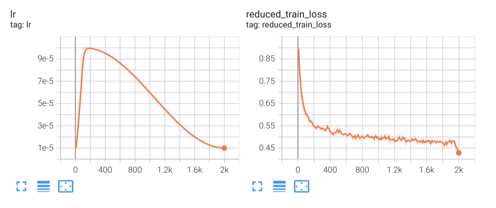
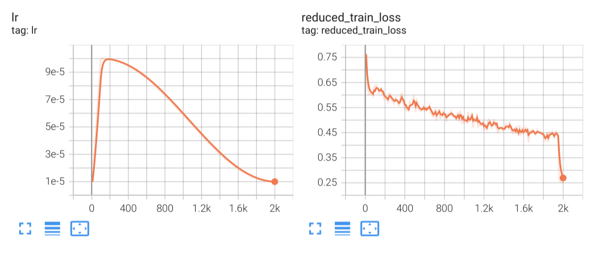

# Train Your Own Reasoning Model in 48 Hours on a Single GPU

This tutorial provides a tried-and-true recipe for training your own reasoning model by fine-tuning a [Meta LLaMA 3.1–8B Instruct](https://huggingface.co/meta-llama/Llama-3.1-8B-Instruct) model with NVIDIA NeMo in about 48 hours on a single H100 80GB GPU.

This recipe is inspired by the [Llama Nemotron family of models](https://www.nvidia.com/en-us/ai-data-science/foundation-models/llama-nemotron/), where the model can selectively turn reasoning on or off based on instructions in the system prompt. You'll train your model on complex instruction-following and reasoning tasks using the [Llama-Nemotron-Post-Training-Data](https://huggingface.co/datasets/nvidia/Llama-Nemotron-Post-Training-Dataset).

## Resources

Checkout the following resources that are used in this tutorial.
* [Llama-Nemotron-Post-Training-Data](https://huggingface.co/datasets/nvidia/Llama-Nemotron-Post-Training-Dataset), an open source dataset for instilling reasoning behavior in large language models.
* The tutorial on [curating the Llama Nemotron Reasoning Dataset with NVIDIA NeMo Curator](https://github.com/NVIDIA/NeMo-Curator/tree/main/tutorials/llama-nemotron-data-curation).
You will need the output from that tutorial for training a reasoning model.

## Hardware Requirements

This playbook enables you to either fine-tune a LoRA adapter, or fine-tune the entire model.

* **Parameter Efficient Fine-Tuning via LoRA adapters**:
  * This playbook has been verified on **a single H100 80GB** when PEFT is enabled.
  * It takes **48 hours** to train the model for 2000 steps and observe reasoning behavior.
* **Full Fine-Tuning**:
  * This playbook has been tested on **8xH100 80GB** GPUs. You can scale training to more GPUs as well as multiple nodes by modifying the appropriate parameters.
  * It takes **12 hours** to train the model for 2000 steps and observe reasoning behavior.

## Training

Please checkout the [Reasoning-SFT.ipynb](./Reasoning-SFT.ipynb) Jupyter notebook, which walks you through everything you need to successfully train your own reasoning model.

### Sample loss plots

For your reference here are the loss plots from our own experiments using 500,000 training samples, with a batch size of 256 and 2000 training steps.

You might be wondering about the sudden loss drop at the end. This is expected!
The training dataset is arranged in the increasing order of sample difficulty (i.e. curriculum learning).
With 500,000 training samples, a batch size of 256 and 2000 steps, that's just slightly over 1 epoch of training.
Towards the end of that epoch, when the model sees the first few (easier samples) again, it can easily predict the right tokens for them so the loss ends up being much lower.

#### LoRA Training Loss Plots

#### Full Fine-tuning Loss Plots

## Evaluation

This section describes how to evaluate your trained reasoning model on various benchmarks. The evaluation process consists of three main steps:

1. **Prepare the Dataset**: Use `prepare_dataset.py` to download and prepare benchmark datasets from HuggingFace. The script supports:
   - [GPQA main](https://huggingface.co/datasets/Idavidrein/gpqa/viewer/gpqa_main)
   - [GPQA diamond](https://huggingface.co/datasets/Idavidrein/gpqa/viewer/gpqa_diamond)
   - [MMLU](https://huggingface.co/datasets/cais/mmlu)

2. **Deploy and Get Responses**: Use `deploy_and_get_responses.py` to:
   - Deploy your trained model using Triton Inference Server
   - Set up OpenAI-like endpoints for querying
   - Generate responses for the selected benchmark

3. **Evaluate Responses**: Use `evaluate_responses.py` to:
   - Extract final answers from model responses
   - Compare with ground truth
   - Calculate model performance metrics

### Hardware Requirements for Evaluation
- At least 1 GPU is required to run the Llama 8B model
- The evaluation scripts have been tested on nvcr.io/nvidia/nemo:25.04

For detailed instructions on running each evaluation script, please refer to the [evaluation README](./evaluation/README.md).

